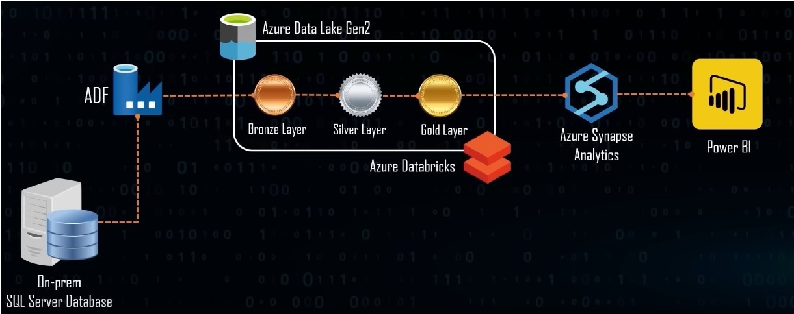
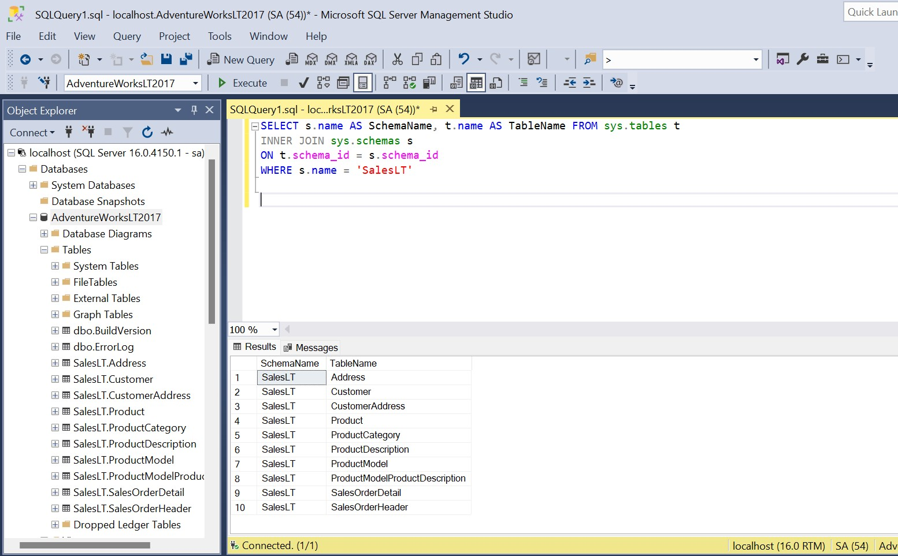

# End_to_End_Azure_Data_Engineering_Project
 This project demonstrates an end-to-end Azure data engineering solution, starting from a local SQL database and culminating in Power BI reporting, all automated.

 ## <ins>Business Objective<ins>
 This project serves as a learning opportunity for common data engineering practices, focusing on ETL pipeline techniques. The skills sharpened here are valuable for small to medium-sized businesses aiming to migrate their local data to the cloud.

1. <b>Architecture Diagram</b>:
    - 

      

## <ins>Current Environment</ins>
- Used Docker for Microsoft SQL Server
- Utilized the AdventureWorks dataset from Microsoft.
- Imported the dataset using Microsoft SQL Server Management Studio.
- Created a new user profile, "eto."
- Saved "eto" profile's password credentials as a Secret in Azure Key Vault.

## <ins>Paths:</ins>

