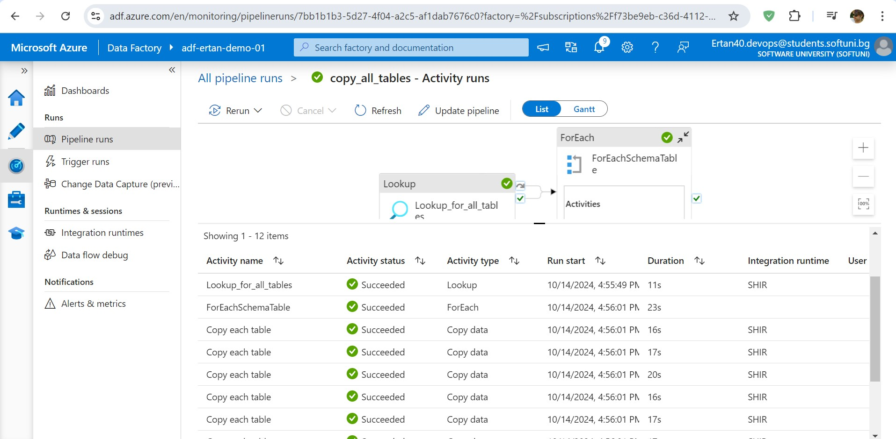
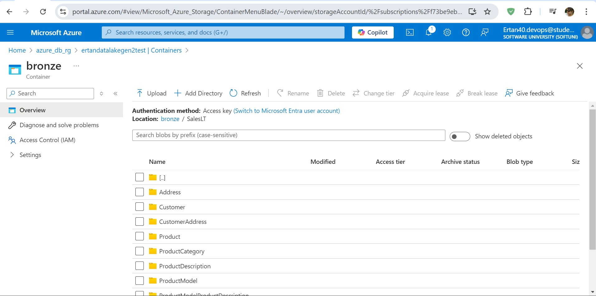
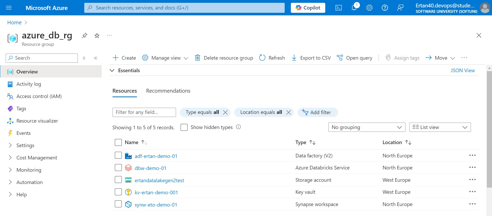
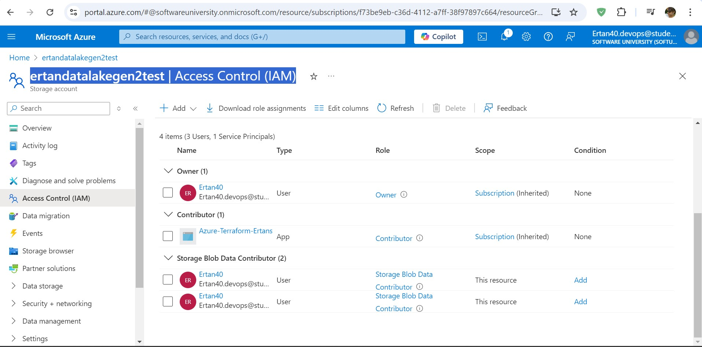
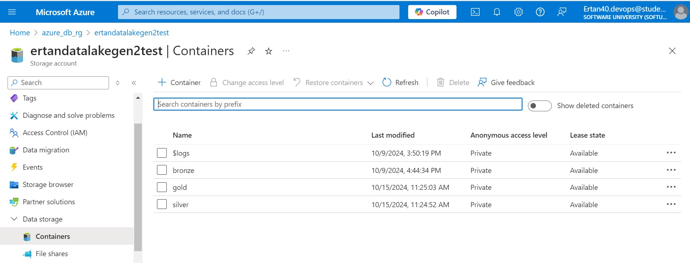
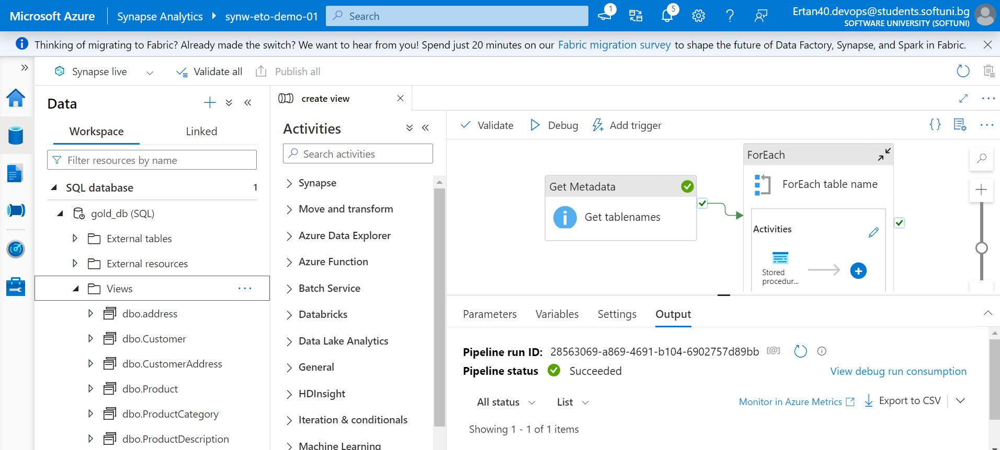
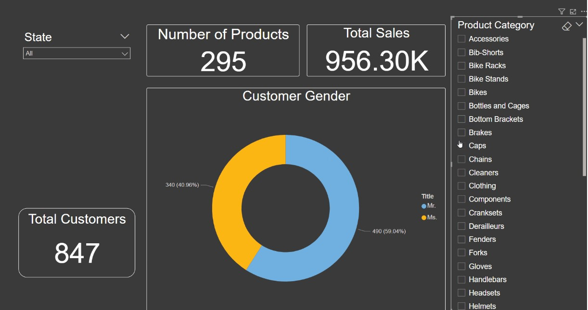
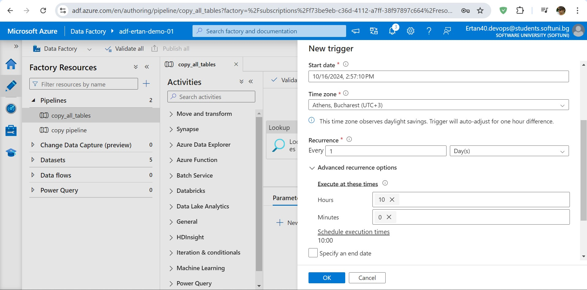
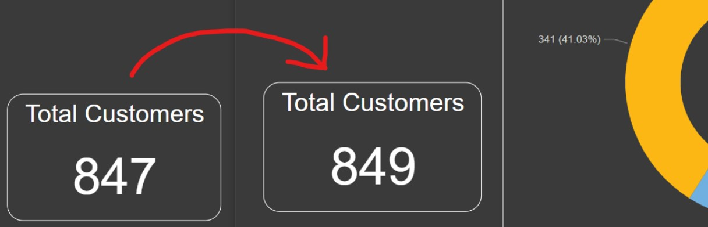

# End_to_End_Azure_Data_Engineering_Project
 This project demonstrates an end-to-end Azure data engineering solution, starting from a local SQL database and culminating in Power BI reporting, all automated.

 ## <ins>Business Objective<ins>
 This project serves as a learning opportunity for common data engineering practices, focusing on ETL pipeline techniques. The skills sharpened here are valuable for small to medium-sized businesses aiming to migrate their local data to the cloud.

1. <b>Architecture Diagram</b>:
    - <p></p>

## <ins>Current Environment</ins>
- Used Docker for Microsoft SQL Server
- Utilized the AdventureWorks dataset from Microsoft.
- Imported the dataset using Microsoft SQL Server Management Studio.
- Created a new user profile, "eto."
- Saved "eto" profile's password credentials as a Secret in Azure Key Vault.
<p></p>

### <ins>How to install SQL server on docker:</ins>
1. Pull the image
```sh
docker pull mcr.microsoft.com/mssql/server:2022-latest
```
2. Run the SQL server container
```sh
docker run -e "ACCEPT_EULA=Y" -e "MSSQL_SA_PASSWORD=<your-password>" -p 1433:1433 --name sqlserver2022 -v my-mssql-data:/var/lib/mssql/data -d mcr.microsoft.com/mssql/server:2022-latest
```
## <ins>1. Data Ingestion</ins>
Data ingestion from the on-premises SQL server to Azure SQL is accomplished via Azure Data Factory. The process involves:

1. Installation of Self-Hosted Integration Runtime.
2. Establishing a connection between Azure Data Factory and the local SQL Server.
3. Setting up a copy pipeline to transfer all tables from the local SQL server to the Azure Data Lake's "bronze" folder.
<p></p>
<p></p>

- Azure Data Lake Gen 2: Used for storage of data. Three containers have been created Bronze, Silver and Gold. The three layers represent the stages of business logic and requirements. The initial data ingested from SQL Server is transformed to parquet format as it provides significant performance, storage, and query optimization benefits in big data processing and analytics scenarios and stored in the bronze container. The next level transformation is performed on the bronze data and stored in the silver container. The final transformation is performed on the silver layer and the data is stored in the gold container. The delta lake abstraction layer has been used on the parquet format files for storing the data in the gold and silver containers to allow for versioning. The data in the gold layer is ideal for reporting and analysis. It can be consumed by Azure Synapse Analytics which in turn can be connected to PowerBI for creating visualizations.
<p></p>
<p></p>  
<p></p> 

## <ins>2. Data Transformation</ins>
After ingesting data into the "bronze" folder, it is transformed following the medallion data lake architecture (bronze, silver, gold). Data transitions through bronze, silver, and ultimately gold, suitable for business reporting tools like Power BI.

It was convenient to access the storage using the credential passthrough feature as the email ID being used for this project was already added to the IAM policy of the data lake. The Data Factory could be connected by using an access token generated from Databricks and saving it as a secret in the Key vault.

Azure Databricks, using PySpark, is used for these transformations. Data initially stored in parquet format in the "bronze" folder is converted to the delta format as it progresses to "silver" and "gold." This transformation is carried out through Databricks notebooks:

1. Mount the storage.
2. Transform data from "bronze" to "silver" layer.
3. Further transform data from "silver" to "gold" layer.
<p></p> 

## <ins>3. Data Loading</ins>
Data from the "gold" folder is loaded into the Business Intelligence reporting application, Power BI. Azure Synapse is used for this purpose. The steps involve:

1. Creating a link from Azure Storage (Gold Folder) to Azure Synapse.
2. Writing stored procedures to extract table information as a SQL view.
3. Storing views within a server-less SQL Database in Synapse.
<p></p>  
<p></p>
<p></p> 
<p></p> 

## <ins>4. Data Reporting</ins>
Power BI connects directly to the cloud pipeline using DirectQuery to dynamically update the database. A Power BI report is developed to visualize AdventureWorks dataset data, including sales, product information, and customer gender.

Database connected and data loaded
<p></p>
Manage relationship 
<p></p>
<p></p>

## <ins>5. Final Pipeline Test</ins>
To verify the end-to-end pipeline, two new customers are added to the local SQL database server. If successful, the pipeline will update, and the Power BI report will dynamically show the new data. The total number of customers should increase from 847 to 849.

Shcedule trigger
<p></p>
<p></p>

## <ins>Conclusion</ins>
This project demonstrates the ability to create an end-to-end ETL cloud solution using Azure. Some considerations:

- The dataset used was small (7mb total, 800 rows). This was done to keep compute + storage costs low for myself.
- Multiple applications were employed for a relatively simple task.
- Given the dataset's simplicity, the project could have been managed entirely through Azure Data Factory, with data cleaning done downstream in Power BI.
- The inclusion of Azure Synapse and Databricks was for the sake of self-learning and emulating real-world business pipelines.
